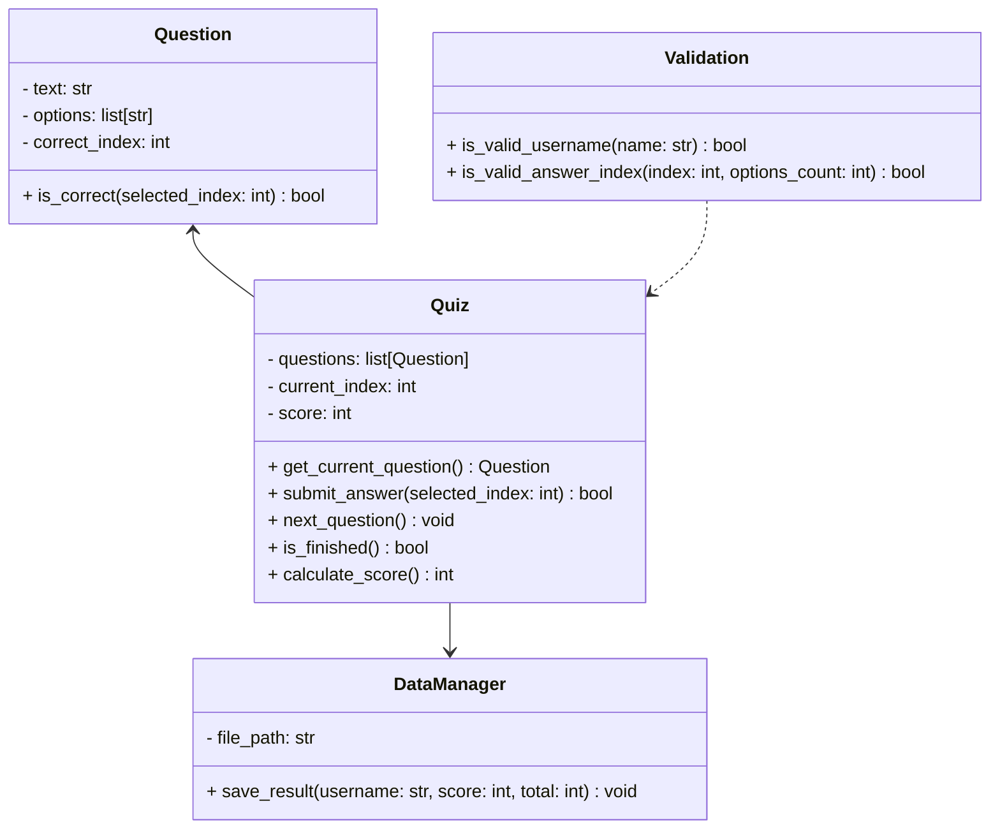
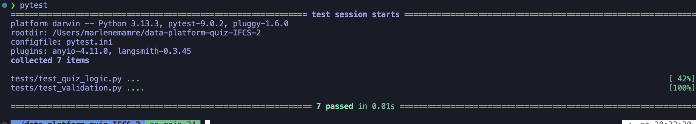

# IBM Data and AI Platform - New Hire Quiz
## Introduction

This IBM Data Platform Quiz Application is a Minimum Viable Product (MVP) developed as an internal training tool for IBM, a global technology consultancy specialising in enterprise cloud, data, and artificial intelligence solutions. Within IBM’s Data and AI organisation, new hires across Technical Sales, Sales, Engineering, and Customer Success roles are expected to quickly develop a working understanding of the watsonx portfolio, including [watsonx.ai](https://www.ibm.com/products/watsonx-ai), [watsonx.data](https://www.ibm.com/products/watsonx-data), [watsonx.governance](https://www.ibm.com/products/watsonx-governance), and [watsonx Orchestrate](https://www.ibm.com/products/watsonx-orchestrate). These products form the foundation of IBM’s enterprise AI strategy and are central to client engagement.

While onboarding materials are available through internal slide decks and documentation repositories, there is currently no lightweight mechanism to assess knowledge retention or reinforce conceptual understanding through interactive engagement. This MVP addresses that gap by delivering a structured, interactive quiz application built using [Python](https://www.python.org/) and [Streamlit](https://streamlit.io/), with modular backend components and persistent storage via CSV files.

The application collects a participant’s name, validates input using deterministic pure functions, and guides users through a sequence of multiple-choice questions. Immediate feedback is provided after each submission to reinforce learning. Upon completion, results are stored in a [CSV file](https://docs.python.org/3/library/csv.html) to simulate lightweight persistence and enable future performance tracking or analytics. This file-based storage approach was intentionally selected to align with portability and transparency requirements, as CSV files can be easily accessed and processed using tools such as Microsoft Excel without additional infrastructure.

Architecturally, the system follows a modular design pattern, separating presentation logic (Streamlit), business logic (Quiz and Question classes), validation (pure functions), and persistence (DataManager). Automated unit testing is implemented using [pytest](https://docs.pytest.org/) to ensure deterministic behaviour of core logic components.

As an MVP, the application prioritises essential functionality: controlled state management, knowledge validation, and result persistence. Advanced features such as authentication, analytics dashboards, or integration with enterprise learning management systems are intentionally out of scope at this stage but represent potential future enhancements.

## Design
### GUI Design

**Figure 1** shows the wireframe created during the early design stage of the application. The design illustrates the intended user journey through the IBM Data Platform New Hire Quiz, from entering a name and progressing through multiple-choice questions to receiving feedback and viewing the final result.

The interface follows a linear, controlled progression designed to guide participants through a structured assessment process. The flow consists of five primary stages:

Welcome → Question → Feedback → Completion (Pass) / Completion (Fail)


**Figure 1: Overall GUI Design**

The Welcome screen serves as the entry point to the quiz and introduces the linear workflow. It contains a single input field for entering a name and a clear “Start Quiz” call‑to‑action. Input validation ensures that only valid names progress, supporting accurate result logging. Additional contextual details—such as estimated completion time—help set user expectations. This screen initialises the quiz state and prepares the participant for the assessment.


**Figure 2: Welcome Page**

The Question screen forms the main interaction stage, displaying one multiple‑choice question at a time to maintain cognitive clarity. A progress indicator (e.g., 1/10) helps orient users, while the structured layout prioritises readability and accessibility. Users must select a single answer before submitting, at which point the application evaluates correctness and locks the selection to preserve assessment integrity.


**Figure 3: Question Page**

After submission, the interface transitions to Feedback mode. This screen highlights the correct answer and provides explanatory text, reinforcing learning and supporting knowledge retention—particularly important in a training context. A single “Next Question” button ensures controlled, sequential progression without skipping or revisiting earlier questions.


**Figure 4: Feedback Page**

If the participant scores below the 70% pass threshold, the Fail screen appears. It communicates the score clearly and uses supportive wording appropriate for a training environment. A “Restart Quiz” option allows the user to immediately attempt the assessment again. This screen represents the final state for unsuccessful quiz attempts.


**Figure 5: Completion Page - Fail**

Participants who achieve 70% or above are shown the Pass screen. It mirrors the Fail layout for consistency but includes a congratulatory message and a “View Certificate” option available only to successful users. A “Restart Quiz” button remains present to support repeated practice.


**Figure 6: Completion Page - Pass**

### Functional and Non-functional Requirements

#### Functional Requirements

| ID  | Requirement |
|-----|-------------|
| FR1 | The application must allow a participant to enter their name before starting the quiz. |
| FR2 | The application must validate the participant’s name using deterministic validation rules (e.g., non-empty, alphabetic characters). |
| FR3 | The application must load and display a set of single‑answer multiple‑choice questions related to the IBM Data & AI Platform.|
| FR4 | The application must present one question at a time in a controlled, linear sequence. |
| FR5 | The application must allow participants to select exactly one answer before submission. |
| FR6 | The application must evaluate the selected answer and determine whether it is correct. |
| FR7 | The application must provide immediate feedback after each question (e.g., “Correct” or “Incorrect”). |
| FR8 | The application must display the correct answer and explanation after the user submits their choice. |
| FR9 | The application must track the participant’s score throughout the quiz session. |
| FR10 | The application must transition automatically to the next question only after feedback has been presented. |
| FR11 | The application must calculate and display a final score upon quiz completion.|
| FR12 | The application must classify the final result as a “Pass” or “Fail” based on a 70% threshold. |
| FR13 | The application must store quiz results (including name, score, timestamp) in a CSV file. |
| FR14 | The application must prevent progression if the user fails to make a selection |
| FR15 | The application must provide a “Restart Quiz” option at completion. |
| FR16 | The application must reset score and progress when the quiz is restarted. |
| FR17 | The application must ensure that questions are presented in the original order defined within the data source. |


#### Non-functional Requirements

| ID   | Requirement |
|------|-------------|
| NFR1 | The application should load and run within a reasonable time (≤ 2 seconds for screen transitions) to support a smooth user experience. |
| NFR2 | The application should be intuitive and easy to navigate without requiring training or documentation. |
| NFR3 | The UI should adhere to a clean, professional design aligned with IBM brand guidelines where possible. |
| NFR4 | The application must ensure that all validation logic is deterministic and testable via unit tests. |
| NFR5 | The system should store results in a CSV format that is portable, human‑readable, and compatible with Excel. |
| NFR6 | The application must log no personally sensitive data beyond the participant’s name. |
| NFR7 | The quiz logic must be fully testable through automated unit testing frameworks such as pytest. |


### Tech Stack

- [Python 3.x](https://docs.python.org/3/) - core programming language.
  
- [Streamlit](https://streamlit.io/) - used to build the graphical user interface (GUI).

- [pytest](https://docs.pytest.org/) - used as the testing framework.

- [CSV file](https://docs.python.org/3/library/csv.html) - used for lightweight, infrastructure‑free persistence. 
- [Python Standard Library (csv, datetime, logging)](https://docs.python.org/3/library/index.html) - used for reading/writing CSVs, timestamping quiz attempts, and providing minimal internal logging for debugging.

- [Git](https://git-scm.com/) - used for version control.

### Code Design

#### Class Diagram


## Development

### Question Class

```
class Question:
    # Represents a single quiz question with multiple-choice answers.

    def __init__(
        self,
        text: str,
        options: List[str],
        correct_index: int,
        feedback_correct: str,
        feedback_incorrect: str
    ) -> None:
        self.text = text
        self.options = options
        self.correct_index = correct_index
        self.feedback_correct = feedback_correct
        self.feedback_incorrect = feedback_incorrect

    def is_correct(self, answer_index: int) -> bool:
        # Check whether the given answer index is correct.

        return answer_index == self.correct_index

    def get_feedback(self, is_correct: bool) -> str:
        # Return feedback based on whether the answer was correct.

        return self.feedback_correct if is_correct else self.feedback_incorrect
```
The constructor initialises all attributes required for both validation and user feedback. Storing feedback within the object ensures that explanatory messaging remains directly associated with the relevant question, rather than being managed externally.

The `is_correct` method performs a deterministic comparison between the selected answer index and the stored correct index. Using an integer index avoids string comparison errors and simplifies evaluation logic.

The `get_feedback` method returns contextual feedback based on the correctness of the response. By encapsulating feedback selection within the class, presentation logic in the user interface layer remains simplified and does not need to interpret correctness rules.

### Quiz Class

```python
def __init__(self, questions: List[Question]) -> None:
    self.questions = questions
    self.current_index = 0
    self.score = 0
    self.user_answers: Dict[int, int] = {}
```
The constructor receives a list of `Question` objects, reinforcing modularity by separating question data from quiz control logic.

Four core attributes are initialised:

- `questions`: stores the ordered list of quiz questions  
- `current_index`: tracks the participant’s current position  
- `score`: maintains the number of correct responses  
- `user_answers`: records the selected answer index for each question  

The `user_answers` dictionary allows responses to be tracked by question index, which supports future extensibility such as review functionality or analytics.

```python
def get_current_question(self) -> Question:
    return self.questions[self.current_index]
```
This method abstracts direct list indexing and ensures that external components do not manipulate internal state directly. By encapsulating question retrieval, the class preserves control over progression logic and reduces the risk of inconsistent access.

```python
def submit_answer(self, answer_index: int) -> bool:
    question = self.get_current_question()
    is_correct = question.is_correct(answer_index)

    self.user_answers[self.current_index] = answer_index

    if is_correct:
        self.score += 1

    return is_correct
```
The `submit_answer` method delegates correctness evaluation to the `Question` object, preserving separation of concerns.

The selected answer index is stored in the `user_answers` dictionary using the current question index as the key. This ensures that each response is explicitly recorded.

If the answer is correct, the cumulative score is incremented. The method returns a boolean value indicating correctness, enabling the user interface layer to render feedback without recalculating validation logic.

```python
def next_question(self) -> None:
    if self.has_next_question():
        self.current_index += 1
```
Progression through the quiz is controlled via the `next_question` method. Rather than incrementing the index directly, the method checks whether another question exists before advancing. This prevents out-of-range errors and ensures safe navigation.

```python
def has_next_question(self) -> bool:
    return self.current_index < len(self.questions) - 1
```
The `has_next_question` method determines whether additional questions remain. Separating this boundary check into a dedicated method improves readability, reduces duplication, and supports targeted unit testing of progression logic.

```python
def get_results_summary(self) -> dict:
    return {
        "score": self.score,
        "total_questions": len(self.questions),
    }
```
The `get_results_summary` method provides a structured representation of the final quiz outcome. Returning a dictionary rather than raw values ensures that result data can be easily consumed by the presentation layer or persistence component.

### DataManager Class

```python
@staticmethod
def load_questions_from_csv(filepath: str) -> List[Question]:
    questions: List[Question] = []

    with open(filepath, newline="", encoding="utf-8") as csvfile:
        reader = csv.DictReader(csvfile)

        required_fields = {
            "question",
            "option1",
            "option2",
            "option3",
            "option4",
            "correct_index",
            "feedback_correct",
            "feedback_incorrect",
        }

        if not required_fields.issubset(reader.fieldnames or []):
            raise ValueError("CSV file is missing required columns.")

        for row in reader:
            try:
                options = [
                    row["option1"],
                    row["option2"],
                    row["option3"],
                    row["option4"],
                ]

                question = Question(
                    text=row["question"],
                    options=options,
                    correct_index=int(row["correct_index"]),
                    feedback_correct=row["feedback_correct"],
                    feedback_incorrect=row["feedback_incorrect"],
                )

                questions.append(question)

            except (KeyError, ValueError) as error:
                raise ValueError(f"Invalid row in CSV file: {row}") from error

    return questions
```
The `load_questions_from_csv` method reads structured question data using `csv.DictReader`, allowing each row to be accessed by column name rather than index position. This improves readability and reduces coupling to column order.

Before processing begins, the method verifies that all required fields are present in the CSV header. This validation step prevents malformed input files from being silently accepted and ensures structural integrity.

For each row, a `Question` object is instantiated dynamically. Converting `correct_index` to an integer enforces type consistency. If any row contains invalid or missing data, a descriptive `ValueError` is raised, preventing corrupted question objects from entering the system.


```python
@staticmethod
def save_results_to_csv(
    filepath: str,
    username: str,
    score: int,
    total_questions: int
) -> None:

    file_exists = False

    try:
        with open(filepath, "r", encoding="utf-8"):
            file_exists = True
    except FileNotFoundError:
        file_exists = False

    with open(filepath, "a", newline="", encoding="utf-8") as csvfile:
        writer = csv.writer(csvfile)

        if not file_exists:
            writer.writerow(["username", "score", "total_questions"])

        writer.writerow([username, score, total_questions])
```
The `save_results_to_csv` method appends quiz outcomes to a results file. Before writing, it checks whether the file already exists. If the file is being created for the first time, a header row is written to maintain structural consistency.

The file is opened in append mode (`"a"`), ensuring that previous results are preserved rather than overwritten. Each submission records the participant’s username, their score, and the total number of questions.

### Validation Utilities

```python
def is_valid_username(username: str) -> bool:
    if not username:
        return False

    if len(username.strip()) < 2:
        return False

    return username.replace(" ", "").isalnum()
```
The `is_valid_username` function enforces three validation rules:

1. The input must not be empty.  
2. After trimming whitespace, it must contain at least two characters.  
3. It must consist only of alphanumeric characters (spaces are permitted but ignored for validation).

```python
def is_valid_answer_index(index: int, num_options: int) -> bool:
    if not isinstance(index, int):
        return False

    return 0 <= index < num_options
```
The `is_valid_answer_index` function ensures that submitted answers fall within the valid range of available options. The type check prevents non-integer values from being evaluated, while the boundary condition guarantees that the index does not exceed the number of options.

### Streamlit Application Layer

```python
# Quiz in progress
quiz: Quiz = st.session_state.quiz
question = quiz.get_current_question()

selected_option = st.radio(
    "Choose an answer:",
    options=list(range(len(question.options))),
    format_func=lambda i: question.options[i],
    key=f"question_{quiz.current_index}",
)

if st.button("Submit Answer") and not st.session_state.answer_submitted:
    if is_valid_answer_index(selected_option, len(question.options)):
        is_correct = quiz.submit_answer(selected_option)
        st.session_state.feedback = question.get_feedback(is_correct)
        st.session_state.answer_submitted = True

if st.session_state.answer_submitted:
    st.info(st.session_state.feedback)

    if quiz.has_next_question():
        if st.button("Next Question"):
            quiz.next_question()
            st.session_state.answer_submitted = False
```

The `initialise_quiz()` helper function loads validated `Question` objects from CSV and constructs a `Quiz` instance. User input is validated before quiz initialisation using pure functions. During quiz progression, answer submission delegates correctness checks to the `Quiz` class, and contextual feedback is rendered dynamically. Results are written to CSV only once per completion cycle, preventing duplicate persistence. This design ensures clear separation between UI rendering and business logic.

## Testing

Automated unit tests were implemented using `pytest` to verify deterministic behaviour of core components. The `Question` and `Quiz` classes were tested for correct answer evaluation, score calculation, and progression boundaries. Validation functions were tested independently to confirm correct handling of invalid usernames and out-of-range indices. By isolating logic from the interface layer, these components could be tested without Streamlit dependencies, improving reliability and maintainability.



**Figure 7: Passing tests using pytest**

## Documentation

### End-User Documentation

The quiz application is designed for internal IBM staff onboarding within the Data and AI Platform. To use the application, staff launch the Streamlit interface and enter their name on the welcome screen.

### Technical Documentation

To run the application locally, users must install dependencies listed in `requirements.txt` and execute:

`streamlit run app.py`

Automated tests can be executed using:

`PYTHONPATH=. pytest`

The system follows a modular structure, separating UI (`app.py`), domain logic (`quiz.py`, `question.py`), validation utilities, and persistence (`data_manager.py`). This structure allows logic components to be tested independently from the interface layer, improving maintainability and reliability.
Evaluation

## Evaluation

Overall, the project successfully met the majority of the defined functional and non-functional requirements. Core functionality — including question loading, controlled progression, scoring logic, input validation, feedback rendering, and persistent result storage — was implemented as intended. The modular architecture supported clean separation of concerns and enabled effective unit testing of business logic.

However, Functional Requirements FR11 and FR12 were not fully implemented. While the application provides structured completion feedback and result storage, it does not yet include extended reporting or advanced visual elements that were originally considered. These features were deprioritised to ensure stability and correctness of core functionality within the available development timeframe.

Additionally, while the Streamlit interface delivers the required functionality, the final UI does not fully reflect the visual refinement presented in the design prototypes. Layout control limitations within Streamlit and time constraints meant that spacing, visual hierarchy, and styling were not implemented to the same standard as the design mock-ups. With additional time, the interface could be improved through custom styling, layout restructuring, or migration to a more flexible frontend framework.

Despite these limitations, the final application meets its primary objective: delivering a structured, reliable internal training tool with validated input, deterministic scoring, and persistent result storage.


