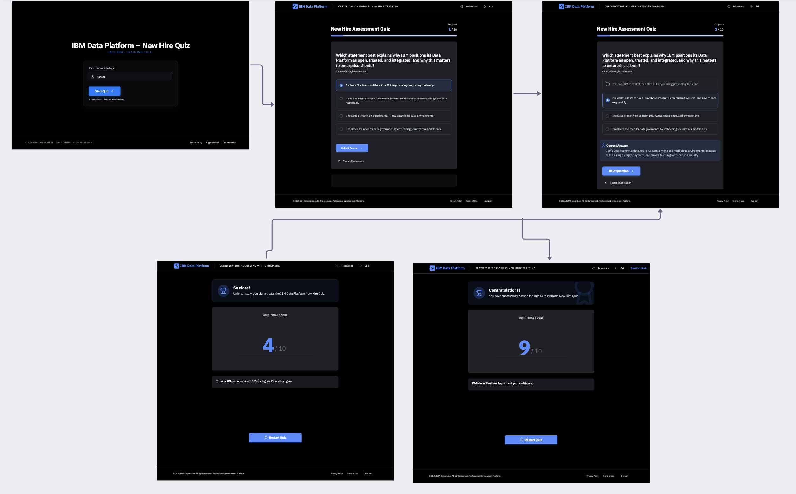
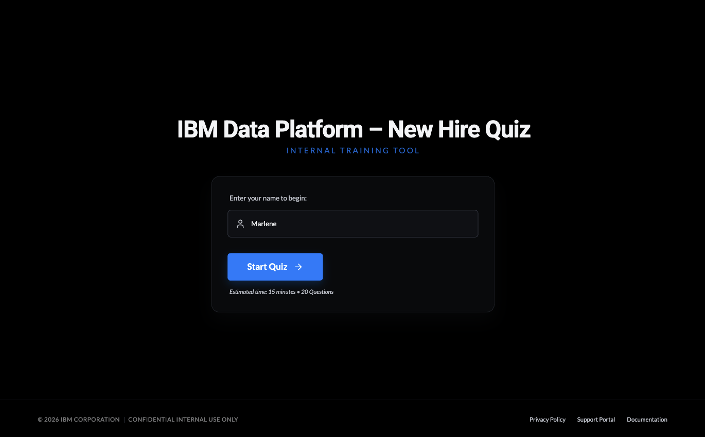
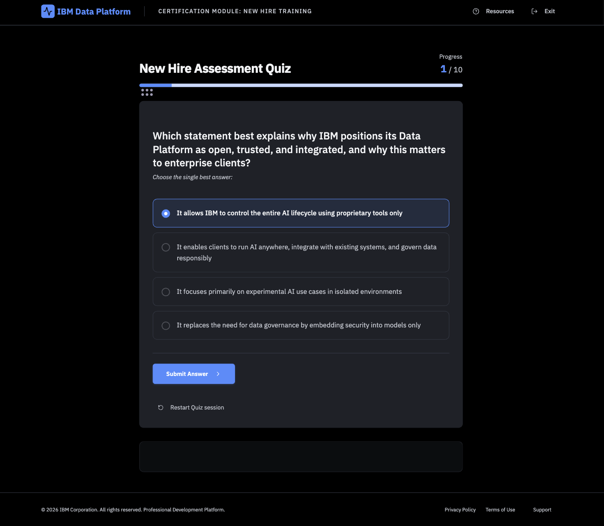
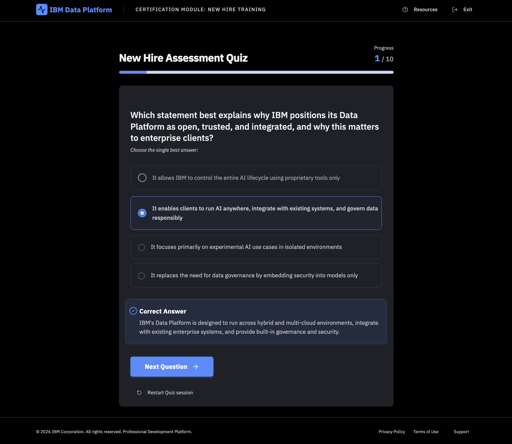
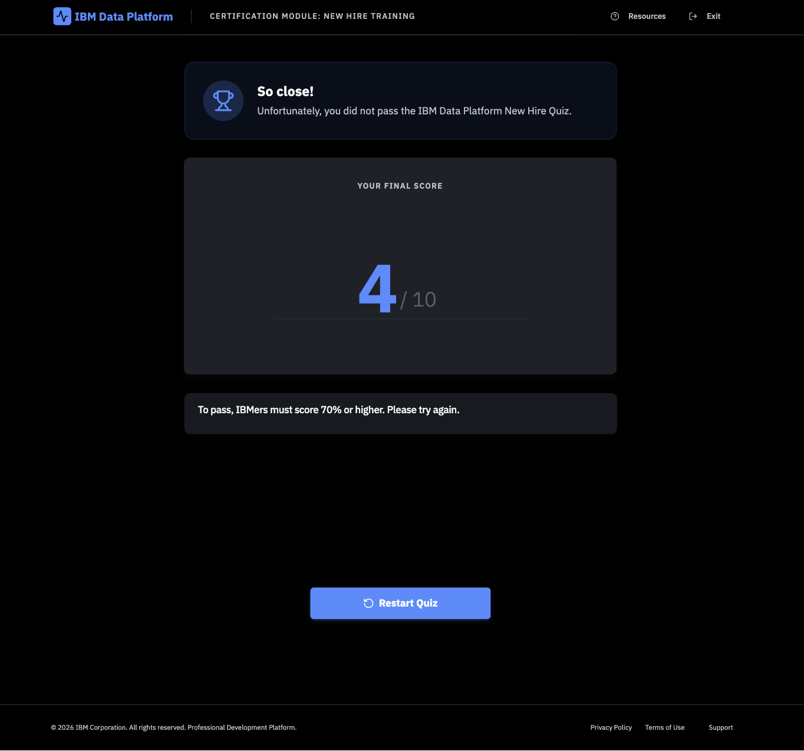
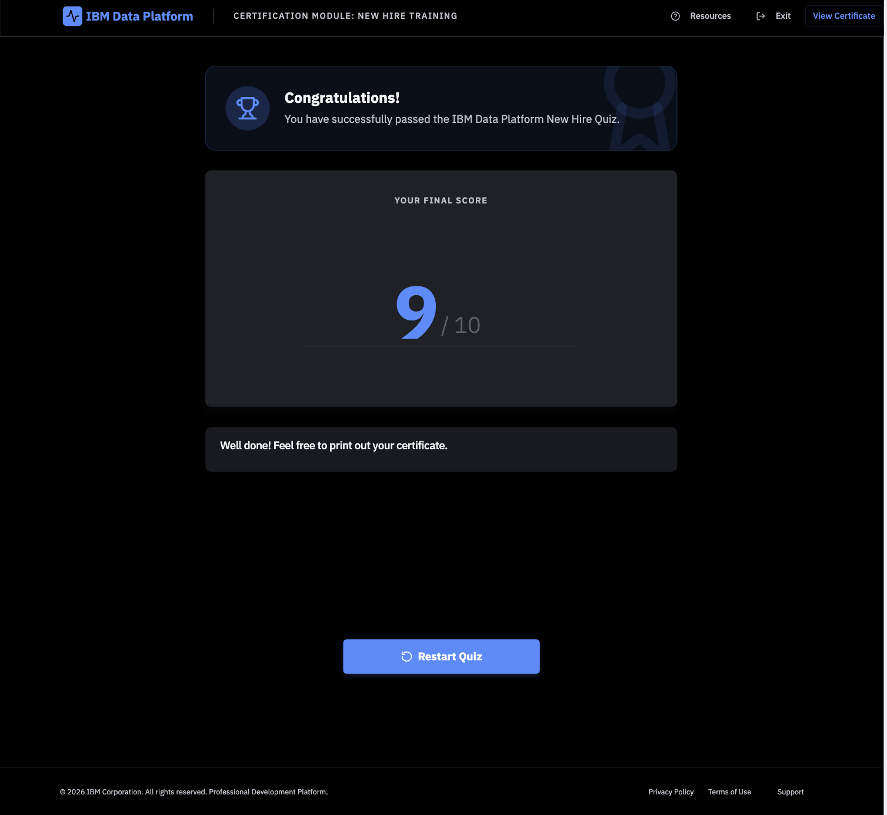
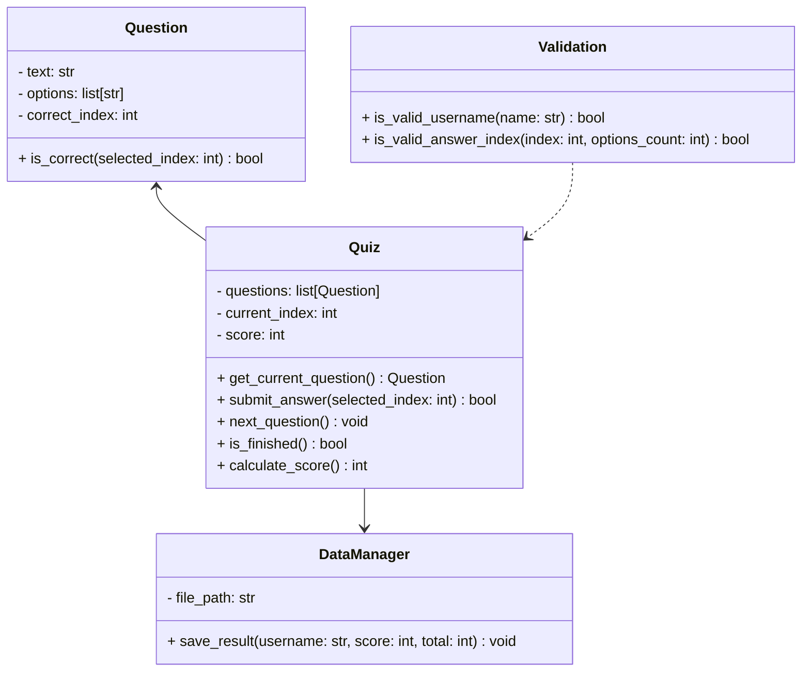

# IBM Data and AI Platform - New Hire Quiz
## Introduction

This IBM Data Platform Quiz Application is a Minimum Viable Product (MVP) developed as an internal training tool for IBM, a global technology consultancy specialising in enterprise cloud, data, and artificial intelligence solutions. Within IBM’s Data and AI organisation, new hires across Technical Sales, Sales, Engineering, and Customer Success roles are expected to quickly develop a working understanding of the watsonx portfolio, including [watsonx.ai](https://www.ibm.com/products/watsonx-ai), [watsonx.data](https://www.ibm.com/products/watsonx-data), [watsonx.governance](https://www.ibm.com/products/watsonx-governance), and [watsonx Orchestrate](https://www.ibm.com/products/watsonx-orchestrate). These products form the foundation of IBM’s enterprise AI strategy and are central to client engagement.

While onboarding materials are available through internal slide decks and documentation repositories, there is currently no lightweight mechanism to assess knowledge retention or reinforce conceptual understanding through interactive engagement. This MVP addresses that gap by delivering a structured, interactive quiz application built using [Python](https://www.python.org/) and [Streamlit](https://streamlit.io/), with modular backend components and persistent storage via CSV files.

The application collects a participant’s name, validates input using deterministic pure functions, and guides users through a sequence of multiple-choice questions. Immediate feedback is provided after each submission to reinforce learning. Upon completion, results are stored in a [CSV file](https://docs.python.org/3/library/csv.html) to simulate lightweight persistence and enable future performance tracking or analytics. This file-based storage approach was intentionally selected to align with portability and transparency requirements, as CSV files can be easily accessed and processed using tools such as Microsoft Excel without additional infrastructure.

Architecturally, the system follows a modular design pattern, separating presentation logic (Streamlit), business logic (Quiz and Question classes), validation (pure functions), and persistence (DataManager). Automated unit testing is implemented using [pytest](https://docs.pytest.org/) to ensure deterministic behaviour of core logic components.

As an MVP, the application prioritises essential functionality: controlled state management, knowledge validation, and result persistence. Advanced features such as authentication, analytics dashboards, or integration with enterprise learning management systems are intentionally out of scope at this stage but represent potential future enhancements.

## Design
### GUI Design

**Figure 1** shows the wireframe created during the early design stage of the application. The design illustrates the intended user journey through the IBM Data Platform New Hire Quiz, from entering a name and progressing through multiple-choice questions to receiving feedback and viewing the final result.

The interface follows a linear, controlled progression designed to guide participants through a structured assessment process. The flow consists of five primary stages:

Welcome → Question → Feedback → Completion (Pass) / Completion (Fail)

The wireframes were used to plan layout structure, validation points, conditional rendering, and navigation flow prior to implementation. They focus on screen hierarchy, interaction sequencing, and user experience design rather than final visual styling.

Each screen corresponds to a distinct phase in the application logic, where progression is triggered only by defined user actions (for example, submitting an answer). This approach ensures predictable behaviour, prevents uncontrolled navigation, and maintains logical consistency throughout the quiz process.

**Figure 1: Overall GUI Design**

The Welcome screen serves as the entry point to the quiz and establishes the controlled, linear workflow of the MVP. The user is presented with a minimalist interface containing a single input field prompting them to enter their name. This stage ensures that every quiz attempt is associated with an identifiable participant, supporting later analytics and CSV‑based result logging.
Input validation occurs before progression: the system checks for empty values or invalid characters via pure validation functions in the backend. The “Start Quiz” CTA (Call to Action) remains the only actionable element on the screen, reinforcing a clear single‑step onboarding process. Supplemental details such as estimated completion time and number of questions are included to set expectations and improve usability. The overall purpose of this screen is to commit the user into a structured session and initialise their quiz state before revealing any questions.

**Figure 2: Welcome Page**

The Question screen is the core interaction layer where users engage with the multiple‑choice content. It displays a single question at a time along with four possible answers, ensuring a cognitively manageable layout aligned with common assessment UI patterns.
A progress indicator at the top (e.g., 1/10) helps orient the user and establishes forward momentum. Users must select exactly one option before proceeding, preventing incomplete submissions. The “Submit Answer” button triggers the backend logic that evaluates correctness, logs the attempt in memory, and locks the UI to prevent answer changes.
This screen is designed with visual hierarchy in mind: the question text is prominent, answer options are clearly spaced, and the submission action is positioned at the bottom to encourage top‑to‑bottom reading flow. This supports accessibility, reduces confusion, and standardises behaviour across all questions.

**Figure 3: Question Page**

After a user submits their answer, the interface transitions into the Feedback state. This screen replaces the “Submit Answer” button with instant correctness feedback, reinforcing learning by confirming whether the selection was right or wrong.
The correct option is highlighted, and an explanatory message is displayed to contextualise the answer. This is important in an enterprise learning setting where the goal is not just assessment, but knowledge reinforcement. This pedagogical design helps new IBM hires understand why a particular answer is correct, supporting better long‑term retention of Data & AI concepts.
A “Next Question” button becomes available and is the only navigation mechanism, ensuring orderly progression. This state change embodies the quiz’s controlled sequential architecture: users cannot skip ahead, revisit previous questions, or modify answers once submitted.

**Figure 4: Feedback Page**

If the user finishes the quiz with a score below the 70% passing threshold, the system transitions to the Fail screen. This view communicates the outcome clearly with large, centralised score formatting and a summarising message explaining that the pass mark has not been met.
The design avoids punitive phrasing; instead, it takes a constructive, encouraging tone appropriate for professional training environments. A single “Restart Quiz” button is provided to allow users to immediately retry. No alternative paths (e.g., certificate generation) are presented, maintaining logical alignment with the pass/fail conditions.
This screen also marks the end of the state machine for unsuccessful attempts and signals the conclusion of the assessment loop.

**Figure 5: Completion Page - Fail**

Users who score 70% or higher are redirected to the Pass screen. Visually similar to the Fail screen for consistency, this screen includes congratulatory messaging and emphasises successful completion with the prominently displayed score.
An additional CTA, “View Certificate”,  appears only on this screen. This conditional UI feature introduces a differentiated end state for successful participants and demonstrates the MVP’s capacity for role‑appropriate branching logic.
As with all previous screens, a “Restart Quiz” option remains available, supporting iterative learning or re-practice.

**Figure 6: Completion Page - Pass**

### Functional and Non-functional Requirements

#### Functional Requirements

| ID  | Requirement |
|-----|-------------|
| FR1 | The application must allow a participant to enter their name before starting the quiz. |
| FR2 | The application must validate the participant’s name using deterministic validation rules (e.g., non-empty, alphabetic characters). |
| FR3 | The application must load and display a set of single‑answer multiple‑choice questions related to the IBM Data & AI Platform.|
| FR4 | The application must present one question at a time in a controlled, linear sequence. |
| FR5 | The application must allow participants to select exactly one answer before submission. |
| FR6 | The application must evaluate the selected answer and determine whether it is correct. |
| FR7 | The application must provide immediate feedback after each question (e.g., “Correct” or “Incorrect”). |
| FR8 | The application must display the correct answer and explanation after the user submits their choice. |
| FR9 | The application must track the participant’s score throughout the quiz session. |
| FR10 | The application must transition automatically to the next question only after feedback has been presented. |
| FR11 | The application must calculate and display a final score upon quiz completion.|
| FR12 | The application must classify the final result as a “Pass” or “Fail” based on a 70% threshold. |
| FR13 | The application must store quiz results (including name, score, timestamp) in a CSV file. |
| FR14 | The application must prevent progression if the user fails to make a selection |
| FR15 | The application must provide a “Restart Quiz” option at completion. |
| FR16 | The application must reset score and progress when the quiz is restarted. |
| FR17 | The application must ensure that questions are presented in the original order defined within the data source. |

#### Non-functional Requirements

| ID   | Requirement |
|------|-------------|
| NFR1 | The application should load and run within a reasonable time (≤ 2 seconds for screen transitions) to support a smooth user experience. |
| NFR2 | TThe application should be intuitive and easy to navigate without requiring training or documentation. |
| NFR3 | The UI should adhere to a clean, professional design aligned with IBM brand guidelines where possible. |
| NFR4 | The application must ensure that all validation logic is deterministic and testable via unit tests. |
| NFR5 | The system should store results in a CSV format that is portable, human‑readable, and compatible with Excel. |
| NFR6 | The application must log no personally sensitive data beyond the participant’s name. |
| NFR7 | The quiz logic must be fully testable through automated unit testing frameworks such as pytest. |

### Tech Stack

- [Python 3.x](https://docs.python.org/3/) - used as the core programming language for implementing quiz logic, data validation, scoring, and file handling. Python was chosen for its readability, strong ecosystem, and ease of writing testable, modular code.
  
- [Streamlit](https://streamlit.io/) - used to build the graphical user interface (GUI). Streamlit enables rapid development of interactive, web‑based applications with minimal boilerplate. It handles UI rendering, session state, button logic, and page transitions for the quiz.

- [pytest](https://docs.pytest.org/) - used as the testing framework for automated unit tests. This ensures pure functions such as input validation, scoring, and question progression behave deterministically and can be verified during development.

- [CSV file](https://docs.python.org/3/library/csv.html) - used for lightweight, infrastructure‑free persistence. The quiz writes participant results (name, score, timestamp) to a CSV file, which can be opened using standard tools such as Excel and supports easy inspection and analysis.

- [Python Standard Library (csv, datetime, logging)](https://docs.python.org/3/library/index.html) - used for reading/writing CSVs, timestamping quiz attempts, and providing minimal internal logging for debugging. These built‑in modules keep the project dependency‑light.

- [Git](https://git-scm.com/) - used to track changes, manage iterations of the MVP, and ensure a maintainable development workflow.

### Code Design

#### Class Diagram

The class diagram illustrates the modular structure of the application, showing how the Quiz class coordinates question progression and scoring, the Question class encapsulates individual question logic, the DataManager handles result persistence, and validation functions enforce input integrity, ensuring clear separation of responsibilities across the system.

## Development

## Testing

## Documentation

## Evaluation

