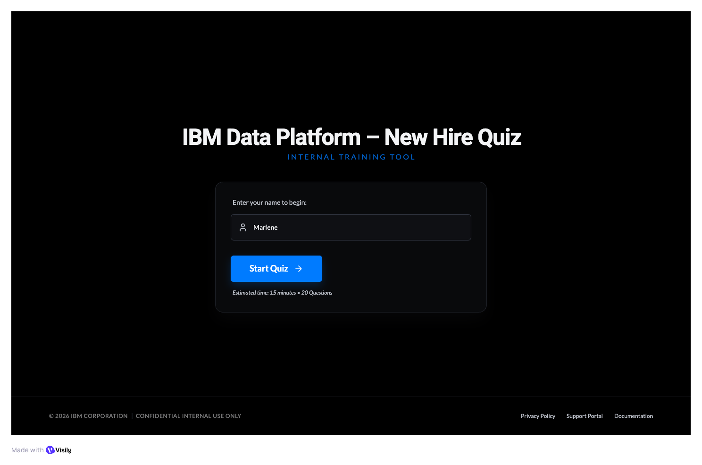

# IBM Data and AI Platform - New Hire Quiz
## Introduction

This IBM Data Platform Quiz Application is a Minimum Viable Product (MVP) developed as an internal training tool for IBM, a global technology consultancy specialising in enterprise cloud, data, and artificial intelligence solutions. Within IBM’s Data and AI organisation, new hires across Technical Sales, Sales, Engineering, and Customer Success roles are expected to quickly develop a working understanding of the watsonx portfolio, including [watsonx.ai](https://www.ibm.com/products/watsonx-ai), [watsonx.data](https://www.ibm.com/products/watsonx-data), [watsonx.governance](https://www.ibm.com/products/watsonx-governance), and [watsonx Orchestrate](https://www.ibm.com/products/watsonx-orchestrate). These products form the foundation of IBM’s enterprise AI strategy and are central to client engagement.

While onboarding materials are available through internal slide decks and documentation repositories, there is currently no lightweight mechanism to assess knowledge retention or reinforce conceptual understanding through interactive engagement. This MVP addresses that gap by delivering a structured, interactive quiz application built using [Python](https://www.python.org/) and [Streamlit](https://streamlit.io/), with modular backend components and persistent storage via CSV files.

The application collects a participant’s name, validates input using deterministic pure functions, and guides users through a sequence of multiple-choice questions. Immediate feedback is provided after each submission to reinforce learning. Upon completion, results are stored in a CSV file to simulate lightweight persistence and enable future performance tracking or analytics. This file-based storage approach was intentionally selected to align with portability and transparency requirements, as CSV files can be easily accessed and processed using tools such as Microsoft Excel without additional infrastructure.

Architecturally, the system follows a modular design pattern, separating presentation logic (Streamlit), business logic (Quiz and Question classes), validation (pure functions), and persistence (DataManager). Automated unit testing is implemented using [pytest](https://docs.pytest.org/) to ensure deterministic behaviour of core logic components.

As an MVP, the application prioritises essential functionality: controlled state management, knowledge validation, and result persistence. Advanced features such as authentication, analytics dashboards, or integration with enterprise learning management systems are intentionally out of scope at this stage but represent potential future enhancements.

## Design
### GUI Design

**Figure 1** shows the wireframe created during the early design stage of the application. The design illustrates the intended user journey through the IBM Data Platform New Hire Quiz, from entering a name and progressing through multiple-choice questions to receiving feedback and viewing the final result.

The interface follows a linear, controlled progression designed to guide participants through a structured assessment process. The flow consists of five primary stages:

Welcome → Question → Feedback → Completion (Pass) / Completion (Fail)

The wireframes were used to plan layout structure, validation points, conditional rendering, and navigation flow prior to implementation. They focus on screen hierarchy, interaction sequencing, and user experience design rather than final visual styling.

Each screen corresponds to a distinct phase in the application logic, where progression is triggered only by defined user actions (for example, submitting an answer). This approach ensures predictable behaviour, prevents uncontrolled navigation, and maintains logical consistency throughout the quiz process.

**Figure 1: Overall GUI Design**

#### Welcome Page

#### Question Page
#### Feedback Page
#### Completion Page - Fail
#### Welcome Page - Pass

